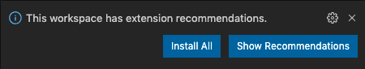

# zoom-utilities

A monorepo app for simplifying Zoom tasks.

## Workspace Setup

1. [Install NodeJS](https://nodejs.org/en/download/ 'https://nodejs.org/en/download/')

2. In a command-line, install dependencies with **`npm ci`**

3. [Install VSCode](https://code.visualstudio.com 'https://code.visualstudio.com')

4. In a command-line and in the project root directory, open VSCode with **`code main.code-workspace`**

5. Install VSCode Extension Recommendations



## Project Setup

See the [client `README.md`](./packages/client/README.md) and [server `README.md`](./packages/server/README.md) documentation.

---

## Commands

<details>
<summary>Local Testing</summary>
<p>
Install dependencies

```bash
npm ci
```

</p>
<p>
Start the application in development mode (hot-code reloading, error reporting, etc.)

```bash
npm start
```

</p>
</details>

<details>
<summary>QA</summary>
<p>
Run unit tests

```bash
npm test
```

</p>
</details>
